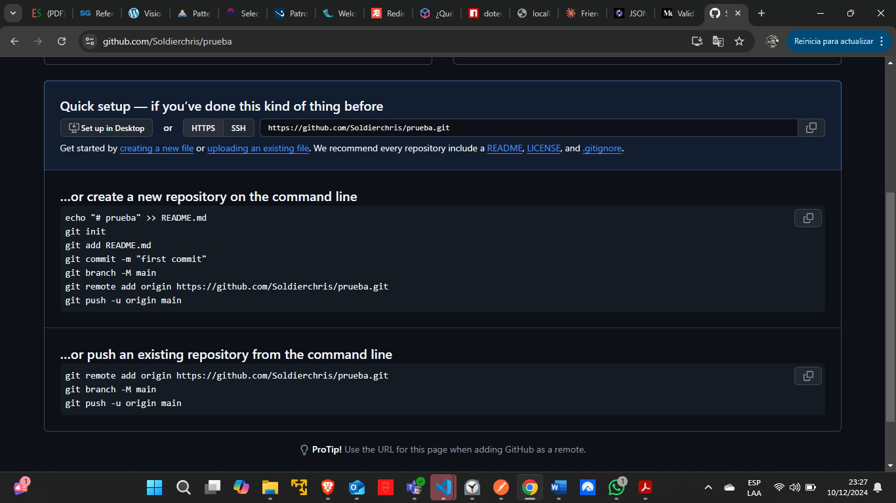

# Ver el repositorio actual
$ git remote -v

origin  https://github.com/Soldierchris/PokeApiRestful.git (fetch)

origin  https://github.com/Soldierchris/PokeApiRestful.git (push)

#Subir un arhivo a Github
1. Crear el repositorio en GitHub
HTTPS
https://github.com/Soldierchris/prueba.git

2. git init
3. git branch -M main
4. git commit -m "first commit"
5. git add . // espacio después del add
6. git init // en ocasiones para reiniciarlo
7. git push -u origin main

…or create a new repository on the command line
echo "# prueba" >> README.md
git init
git add README.md
git commit -m "first commit"
git branch -M main
git remote add origin https://github.com/Soldierchris/prueba.git
git push -u origin main

…or push an existing repository from the command line
git remote add origin https://github.com/Soldierchris/prueba.git
git branch -M main
git push -u origin main

